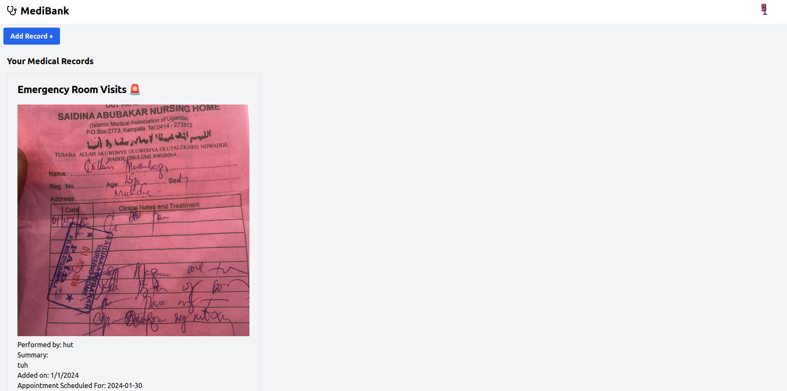

# [MediBank]
This project uses web5 to electronically store a patients medical records in a Decentralized Web Node. Users can effortlessly add, read, and delete medical records, offering a streamlined solution for organizing their health information. Moreover, the platform enables users to securely share their medical records with healthcare professionals using the professional's Decentralized Identifier (DID).

[](https://medi-bank.vercel.app/)

## How it works
It enables a user  to easily save their medical records to a Decentralized Web Node and easily share them to any medical provider safely and privately. This action requires both the user and medical provider to have DID's to enable secure communication between the parties. The DID also acts as a key that enables the user to create, read and delete records added to the DWN.

The app is composed of 4 main components: records, recipient, receivedRecords and index itself.

Inside index we initialize web5 and generate a DID, all dids are unique and are used as passkeys to configure protocols and to interact with records on the DWN. We also use this did to generate a unique avatar for each of our users inside navbar. We define , install and configure a custom protocol to set permissions for users and the data that is allowed on the protocol.

When a user uploads a filled form, we construct a medical record and write that record and its accompanying image to a DWN. 

We call two separte functions to fetch our records: fetchMedicalRecords and fetchReceivedRecords

The two functions are identical save for an if statement that checks whether the id of an author on a record matches my did, if so the records are personal, else the records were received from another user.  

```bash

if (data.author && data.author === myDid)

```

We use the records and the receivedRecords components to display these records we fetched.

The receipient component takes web5, did, recordId and recipientId and writes a record to the recipientId's DWN. 

The records component displays our records and enables the delete function. it takes the recordId, web5 and did to delete a record from the DWN.


## Running Locally
 You can git clone from [this](https://github.com/greatsage-raphael/medibank).

### Cloning the repository the local machine.

```bash
git clone https://github.com/greatsage-raphael/MediBank

```

### Running the app on local machine.
```bash
npm i

npm run dev 
```


